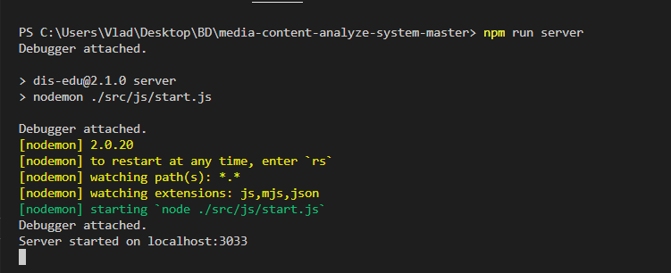
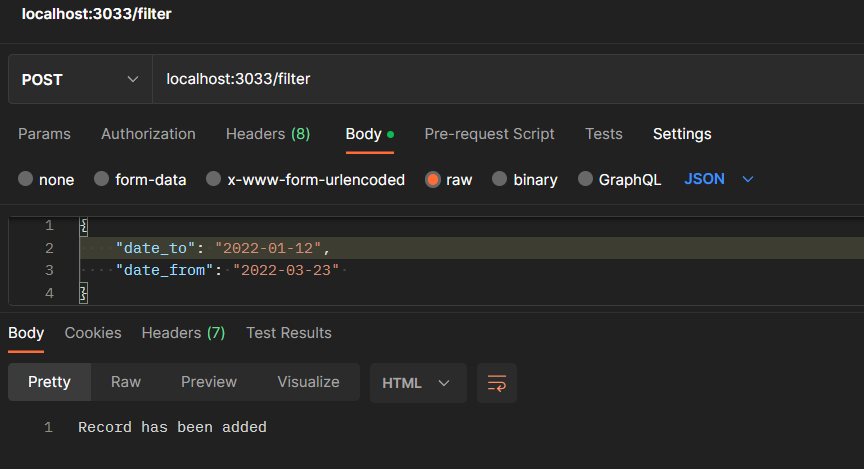
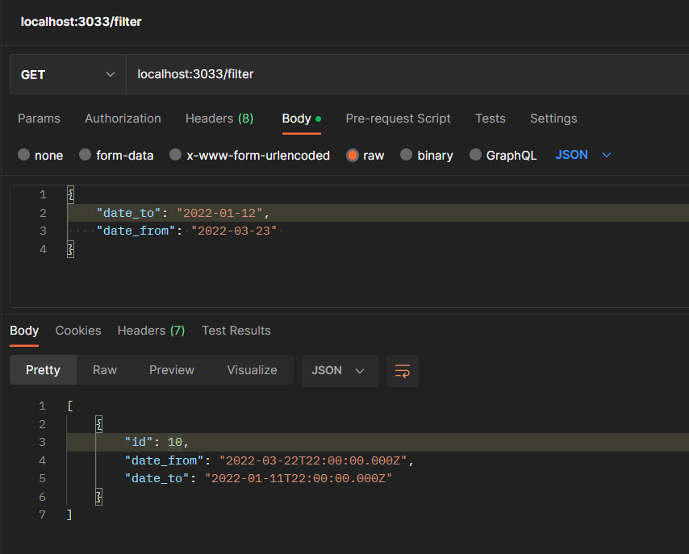
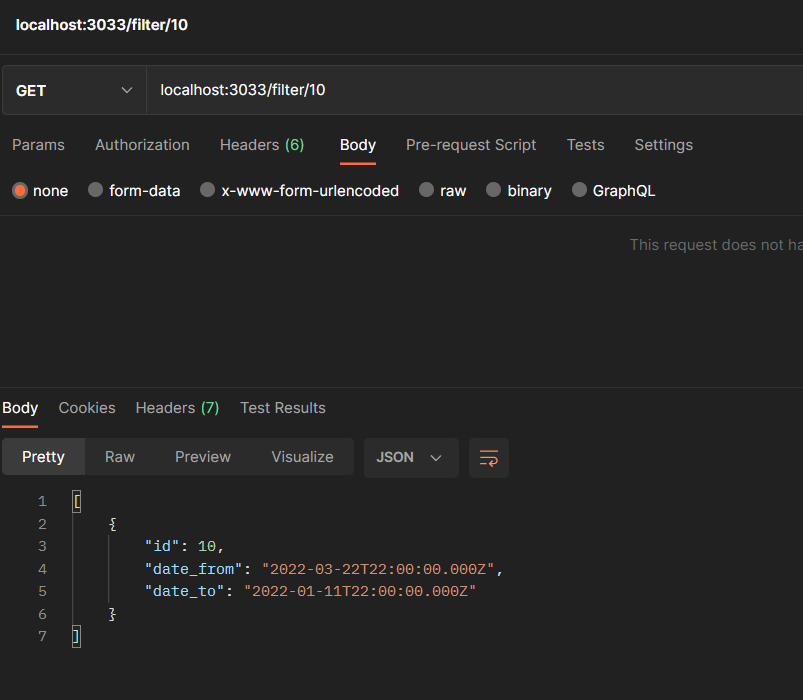
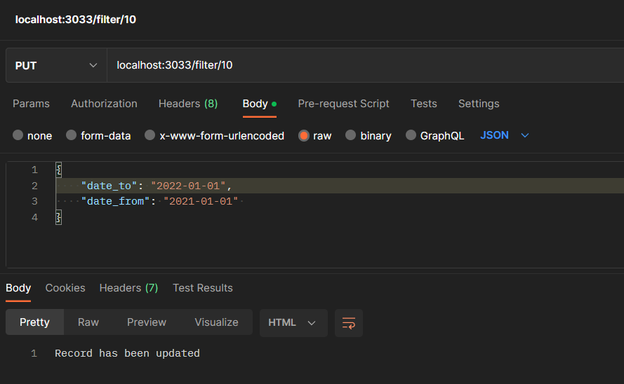
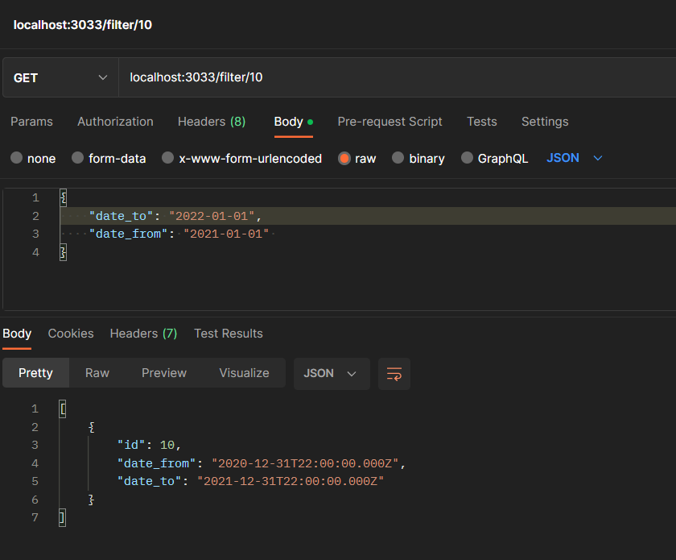
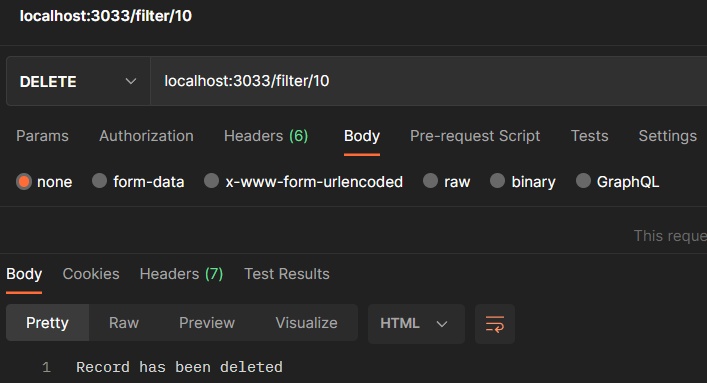
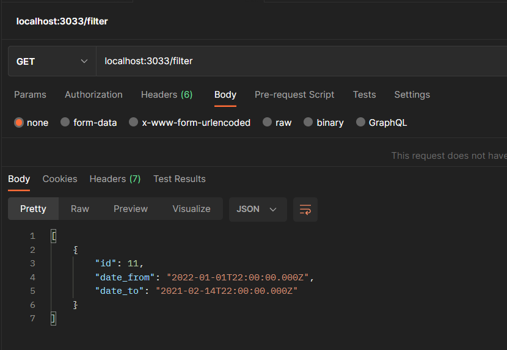

# Тестування працездатності системи

## Основні положення

Тестування відбувається через **Postman** - програмне забезпечення для роботи з API (у тому числі тестування).

Запуск серверу з файлу **start.js**:  

## Тестування REST API

### POST - create

#### Таблиця перед запитом

#### Запит

#### Таблиця після запиту (різниця в дві години через приведення до Гринвіцького часу)

### GET - read

#### Усі елементи

#### Пошук за ID

### PUT - update

#### Елемент перед запитом

#### Запит

#### Елемент після запиту

### DELETE

#### Таблиця перед запитом (додав ще один)

#### Запит

#### Таблиця після запиту
